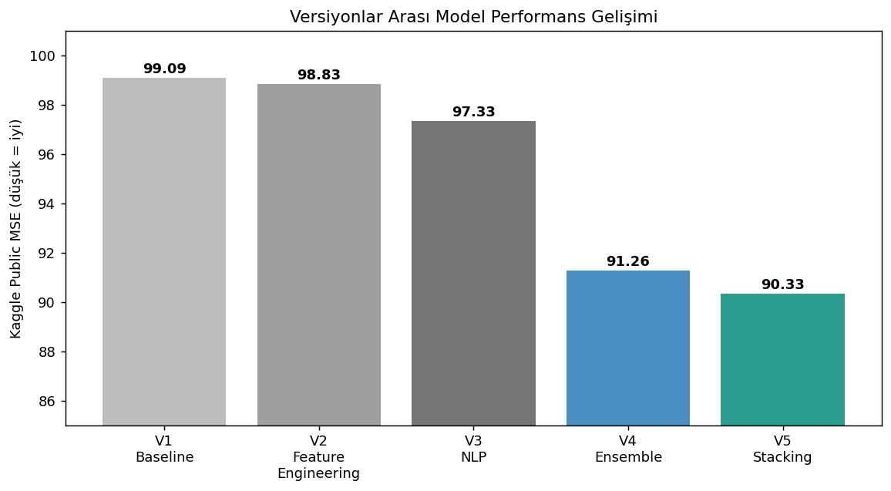
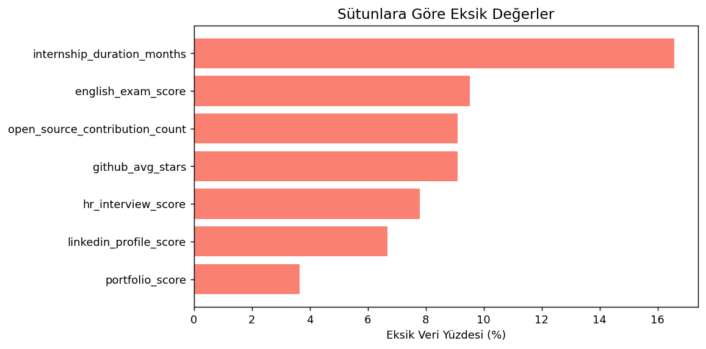
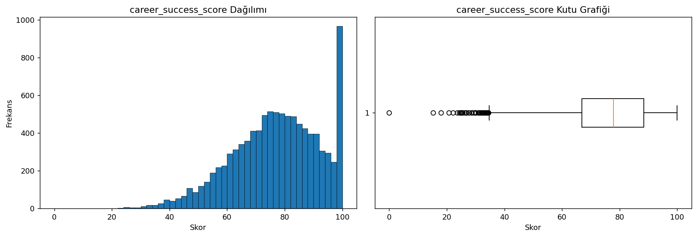
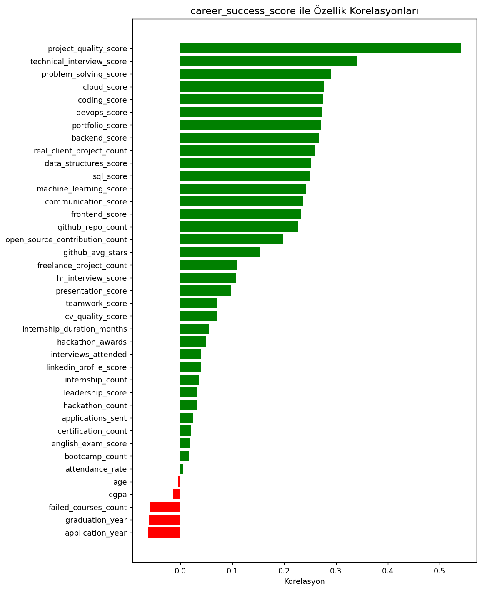
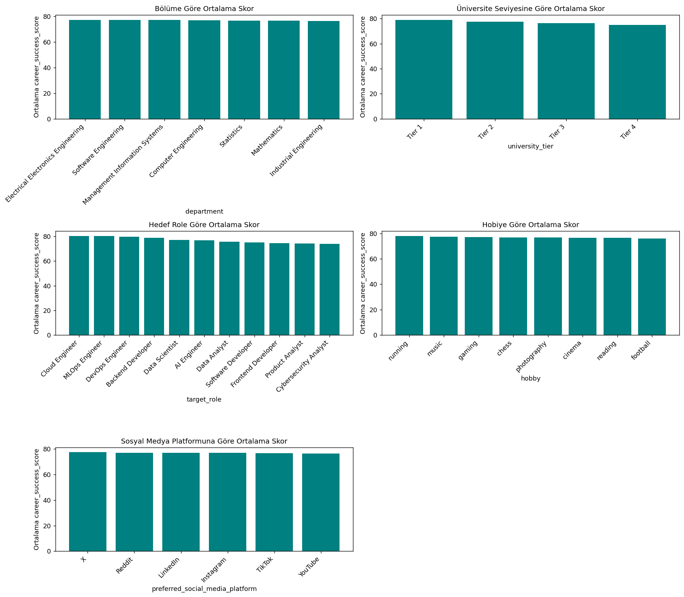
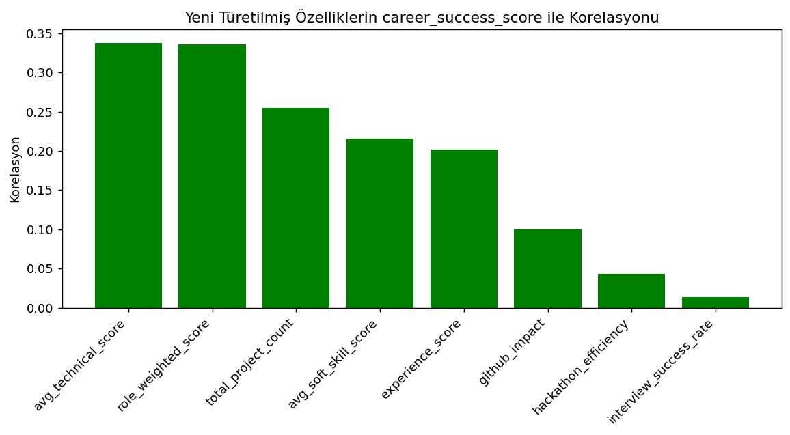
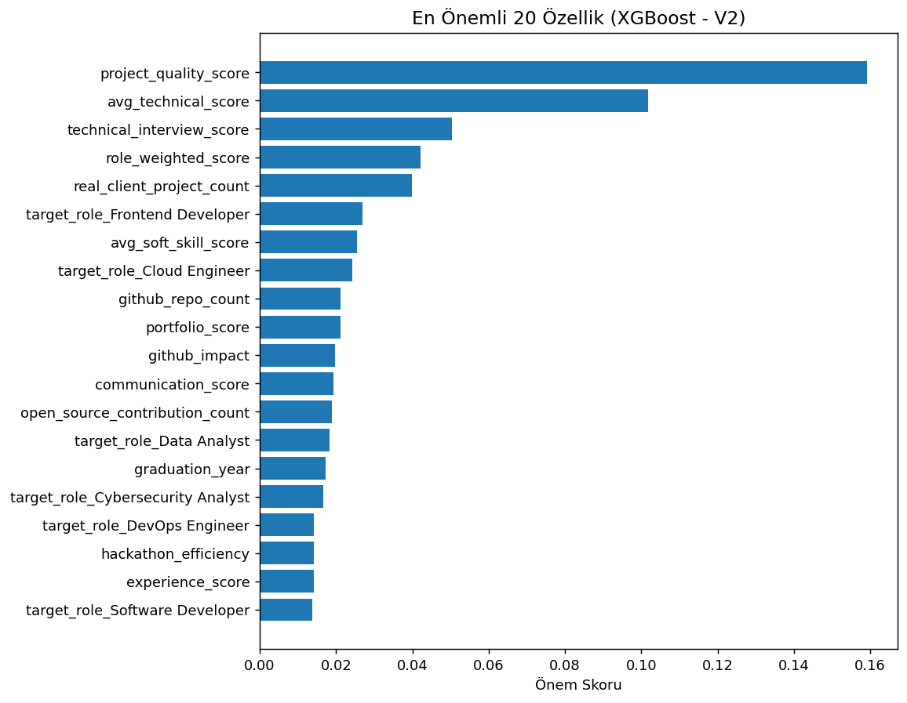
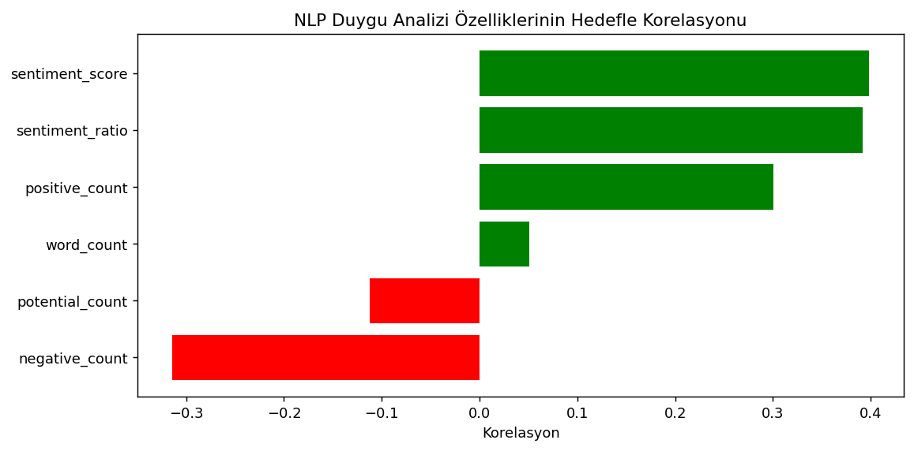

# BTK Datathon 2026 — Kariyer Başarı Skoru Tahmini

Google ve Girişimcilik Vakfı iş birliğiyle BTK Akademi tarafından düzenlenen **Datathon 2026** yarışması için geliştirilmiş uçtan uca bir makine öğrenmesi ve doğal dil işleme (NLP) projesi. Amaç, öğrencilerin akademik, teknik, proje, portfolyo, mülakat ve sosyal profil verilerinden yola çıkarak 0-100 arasında sürekli bir hedef değişken olan **career_success_score** (kariyer başarı skoru) değerini tahmin etmektir.

**Yarışma metriği:** Ortalama Kare Hata (MSE) — düşük skor daha iyidir.

| | |
|---|---|
| **En iyi Kaggle public skoru** | 90.33 (MSE) |
| **Kaggle profili** | [kaggle.com/serdararici](https://www.kaggle.com/serdararici) |
| **Detaylı proje raporu (PDF)** | [BTK_Datathon_2026_Proje_Dokumantasyonu.pdf](./BTK_Datathon_2026_Proje_Dokumantasyonu.pdf) |
| **Geliştirme ortamı** | Google Colab |

---

## İçindekiler

- [Proje Hakkında](#proje-hakkında)
- [Veri Seti](#veri-seti)
- [Proje Yapısı](#proje-yapısı)
- [Yöntem ve Versiyon Geçmişi](#yöntem-ve-versiyon-geçmişi)
- [Keşifsel Veri Analizi](#keşifsel-veri-analizi)
- [Feature Engineering](#feature-engineering)
- [NLP — Mentor Geri Bildirimi Analizi](#nlp--mentor-geri-bildirimi-analizi)
- [Modelleme ve Ensemble](#modelleme-ve-ensemble)
- [Sonuçlar](#sonuçlar)
- [Öğrenilen Dersler](#öğrenilen-dersler)
- [Kullanılan Araçlar](#kullanılan-araçlar)

---

## Proje Hakkında

Veri setinde sayısal, kategorik ve doğal dil tabanlı alanlar birlikte bulunuyor. `mentor_feedback_text` alanı, öğrencinin gelişimi ve potansiyeli hakkında mentor perspektifinden yazılmış kısa bir Türkçe değerlendirme metni içeriyor. Yarışmanın temel beklentisi, klasik sayısal değişkenlerin yanında bu metin alanından da NLP teknikleriyle bilgi çıkarmaktı.

Proje, tek seferde büyük bir model kurmak yerine **aşamalı ve ölçülebilir** bir yaklaşımla geliştirildi: her versiyon öncekinin üzerine tek bir fikir ekledi ve her versiyon Kaggle'a gönderilerek gerçek etkisi ölçüldü.

## Veri Seti

| Dosya | Açıklama |
|---|---|
| `train.csv` | 10.000 öğrenci, 47 sütun (hedef değişken dahil) |
| `test_x.csv` | 10.000 öğrenci, 46 sütun (hedef değişken hariç) |
| `sample_submission.csv` | Submit formatı örneği |

Özellik grupları: akademik bilgiler (cgpa, devam oranı), teknik beceri skorları (coding, ML, backend, frontend, devops...), proje/staj/hackathon deneyimi, portfolyo ve GitHub aktivitesi, mülakat sonuçları, iletişim/takım çalışması gibi sosyal beceriler ve mentor geri bildirim metni.

## Proje Yapısı

```
btk-datathon-2026/
├── notebooks/
│   ├── v1_baseline.ipynb              # İlk model, feature engineering yok
│   ├── v2_feature_engineering.ipynb   # Türetilmiş sayısal özellikler
│   ├── v3_nlp.ipynb                   # Sentiment + TF-IDF entegrasyonu
│   ├── v4_final.ipynb                 # Ensemble + Optuna hiperparametre tuning
│   └── v5_advanced.ipynb              # Stacking + etkileşim/log özellikleri (final model)
├── images/                            # README görselleri
├── BTK_Datathon_2026_Proje_Dokumantasyonu.pdf   # Detaylı proje raporu
└── README.md
```

Her notebook, Colab'a kaydedilirken kendi Colab açma linkini içerecek şekilde GitHub'a yüklendi; bu sayede her biri tek başına çalıştırılabilir durumda.

## Yöntem ve Versiyon Geçmişi

| Versiyon | Eklenen Geliştirme | Kaggle Public MSE |
|---|---|---|
| V1 | Baseline XGBoost (feature engineering yok) | 99.09 |
| V2 | Feature engineering (toplamlar, oranlar) | 98.83 |
| V3 | NLP özellikleri (sentiment + TF-IDF) | 97.33 |
| V4 | Ensemble (XGBoost + LightGBM + CatBoost) + Optuna tuning | 91.26 |
| V5 | Stacking + etkileşim özellikleri + log dönüşümleri | **90.33** |



## Keşifsel Veri Analizi

EDA aşamasında öne çıkan bulgular:

- **Eksik veri:** `internship_duration_months` sütununda %16.57 eksik değer vardı. Bu eksiklerin %82'sinin sıfır staj yapan öğrencilere ait olduğu görüldü — bu yüzden kör medyan doldurma yerine "staj yoksa süre 0" mantığıyla akıllı bir doldurma stratejisi uygulandı.
- **Hedef dağılımı:** career_success_score ortalama 76.9, hafif sola çarpık bir dağılıma sahip (çarpıklık −0.45). 773 öğrenci tam 100 skorunu almış — veri setine kasıtlı olarak eklenmiş bir tavan etkisi olduğu görülüyor.
- **Korelasyonlar:** `project_quality_score` (0.54) en güçlü sinyal. `cgpa` tek başına neredeyse hiç korelasyon göstermedi (−0.01) — bu sezgiye aykırı bulgu daha sonra etkileşim özellikleriyle değerlendirildi.
- **Gürültü sütunları:** `hobby` ve `preferred_social_media_platform` kategorileri arasında anlamlı fark bulunmadı, bu sütunlar modelden çıkarıldı.










## Feature Engineering

Ham veriden türetilen başlıca özellikler:

- `avg_technical_score`, `avg_soft_skill_score` — beceri gruplarının ortalamaları
- `role_weighted_score` — hedef role göre ağırlıklandırılmış teknik beceri skoru
- `experience_score` — staj, gerçek müşteri projesi, freelance ve hackathon deneyiminin ağırlıklı bileşimi
- Etkileşim özellikleri (örn. `technical_interview_score × problem_solving_score`)
- `cgpa` etkileşimleri — tek başına anlamsız olan cgpa'nın diğer özelliklerle birlikte taşıdığı gizli sinyali ortaya çıkarmak için
- Sağa çarpık sayım özellikleri için log1p dönüşümleri (örn. `github_avg_stars`)

Türetilen özelliklerin hedefle korelasyonu ve XGBoost modelindeki önem sıralaması:




## NLP — Mentor Geri Bildirimi Analizi

`mentor_feedback_text` alanından üç katmanlı bir strateji ile bilgi çıkarıldı:

1. **Sentiment kelime sayımı** — Türkçe pozitif/negatif/potansiyel kelime listeleri ile metin başına sayım
2. **Sentiment skoru ve oranı** — pozitif/negatif kelime dengesi
3. **TF-IDF** — Türkçe stopword temizliği ile otomatik olarak seçilen en ayırt edici 100 kelime/kelime grubu

`sentiment_score`, hedefle **0.40 korelasyona** ulaştı — `project_quality_score`'dan sonra ikinci en güçlü sinyal oldu. TF-IDF analizi, "ancak" kelimesinin en güçlü negatif sinyal olduğunu doğruladı (−0.24); Türkçe'de bu kelime genellikle bir övgüden sonra eleştiri getiriyor.



## Modelleme ve Ensemble

- **Temel modeller:** XGBoost, LightGBM, CatBoost — tablo verisi için kanıtlanmış gradient boosting modelleri
- **Hiperparametre optimizasyonu:** Optuna ile 5-fold çapraz doğrulama üzerinde otomatik arama; projenin tek başına en büyük iyileştirmesini sağladı (~6 puan Kaggle MSE düşüşü)
- **Stacking ensemble:** Her modelin out-of-fold (OOF) tahminleri bir Ridge meta-modeline girdi olarak verildi; meta-model her temel modele ne kadar güvenileceğini veriden öğrendi (CatBoost'a en yüksek ağırlık: 0.60)

## Sonuçlar

Proje, Kaggle public MSE skorunu **99.09'dan 90.33'e** düşürdü (8.76 puan iyileştirme). Yapılan ileri analizde, veri setinin doğasında kasıtlı olarak eklenmiş bir gürültü payı bulunduğu (R² tavanı ~0.64) ve modelin bu tavana yakın bir performansa ulaştığı tespit edildi. Tüm detaylar ve denenip elenen ek yöntemler [PDF raporunda](./docs/BTK_Datathon_2026_Proje_Dokumantasyonu.pdf) ayrıntılı olarak açıklanmıştır.

## Öğrenilen Dersler

- Hiperparametre tuning, tek başına en büyük kazancı sağladı — doğru ayarlar bazen yeni özelliklerden daha değerli olabiliyor.
- NLP gerçekten katkı sağladı; basit kelime sayımı ile gelişmiş TF-IDF birbirini doğruladı.
- Her fikir işe yaramadı; bu denemeler de (neden işe yaramadıkları açıklamasıyla birlikte) belgelendi.
- Veri setinin teorik bir gürültü tabanı var; bunu fark etmek imkansız kazançların arkasından koşmayı önledi.

## Kullanılan Araçlar

`Python` · `Pandas` · `NumPy` · `Scikit-learn` · `XGBoost` · `LightGBM` · `CatBoost` · `Optuna` · `Matplotlib` · `Seaborn` · `Google Colab` · `Kaggle`

---

**Yazar:** Serdar Arıcı
**Lisans:** MIT
